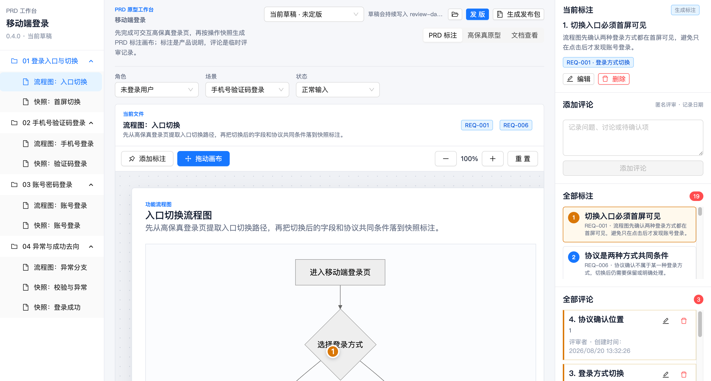
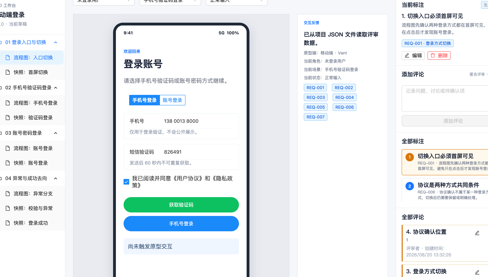
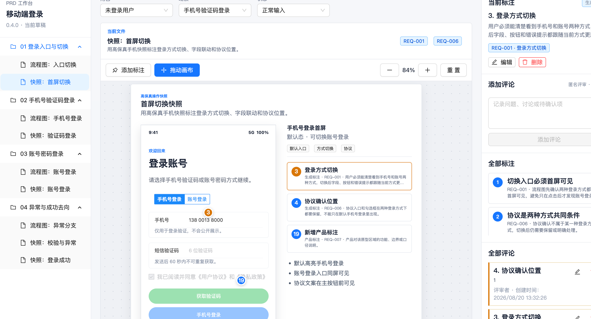
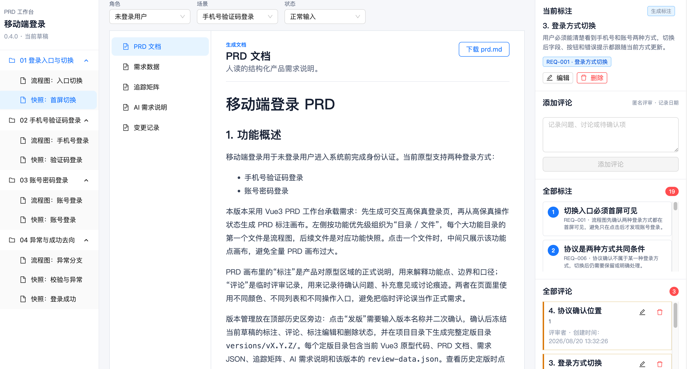

# PRD Skill

> 从一句功能想法开始，生成可演示、可评审、可追踪的 Vue3 高保真 PRD 原型工作区。

[](#快速开始)
[](#模板能力)
[](#模板能力)
[](#维护与验证)

`prd-skill-dev` 是 Codex `$prd` 技能的开发源码仓库。它把零散需求转成一个完整的产品评审工作台：左侧功能目录、可交互高保真原型、带标注的 PRD 画布、结构化需求文档、追踪矩阵、AI 交接说明、评审评论、定版历史和平台无关发布包。

## 效果图预览

| PRD 标注画布 | 高保真原型 |
| --- | --- |
|  |  |
| 快照标注 | 文档查看 |
|  |  |

## 适合谁

- 产品经理：快速把想法变成可以评审和演示的原型工作区。
- 研发团队：拿到稳定的 `REQ-###`、交互状态、验收标准和 AI 可读交接说明。
- AI/Codex 协作流：让后续编码代理基于同一份事实工作，而不是从聊天记录里猜需求。
- 需求评审场景：本地保留草稿编辑，定版后保留只读历史和追加评论。

## 核心亮点

- **一句话生成完整工作区**：默认输出 Vue3 + Vite + TypeScript + Pinia 项目。
- **PRD 与原型同源**：`requirements.json`、`prd.md`、原型数据和画布标注共享同一组需求事实。
- **高保真优先**：先做可操作原型，再从关键操作状态生成 PRD 画布。
- **稳定追踪**：每个关键行为绑定 `REQ-###`，支持需求到界面、交互和验收的追踪。
- **本地文件持久化**：评审、评论和定版信息写入项目 JSON 文件，不使用浏览器本地存储。
- **定版历史独立快照**：`versions/vX.Y.Z/` 冻结每次定版内容，历史版本只读。
- **平台无关发布包**：发布动作只生成 `publish/*.zip`，不绑定 Vercel、Cloudflare Pages 或任何部署平台。

## 仓库结构

```text
.
├── AGENTS.md                         # 本仓库协作与维护规则
├── README.md                         # 项目说明
├── scripts/
│   ├── generate-template-manifest.mjs # 重新生成模板锁定清单
│   └── sync-installed-skill.mjs       # 检查或同步本机 Codex 技能安装副本
└── skill/
    ├── SKILL.md                      # Codex 技能入口说明
    ├── assets/vue3-prd-template/      # Vue3 PRD 工作区模板
    ├── references/                    # 输出契约、原型准则、工作流说明
    └── scripts/validate_prd_package.mjs
```

重要边界：

- `skill/` 是唯一开发源码。
- `~/.codex/skills/prd` 是安装副本，只能由同步脚本更新。
- 生成后的业务 PRD 项目只能改 `src/prototype/`、`src/data/prdData.ts`、`src/data/generatedDocs.ts`、文档、评审 JSON 和版本目录。
- 工作台固定使用 Ant Design Vue；移动原型使用 Vant，桌面原型使用 Ant Design Vue。

## 快速开始

如果你只是想使用 `$prd`，最推荐的方式是直接让 Codex 从这个仓库安装技能。可以在 Codex 中发送：

```text
请从 git@github.com:jinpikaFE/prd-skill-dev.git 仓库的 skill/ 目录安装 Codex skill，安装后技能名为 prd。
```

如果当前 Codex 环境无法访问 SSH 仓库，可以改用 HTTPS 地址：

```text
请从 https://github.com/jinpikaFE/prd-skill-dev.git 仓库的 skill/ 目录安装 Codex skill，安装后技能名为 prd。
```

安装完成后即可直接使用：

```text
$prd 做一个移动端会员积分兑换功能原型
```

如果你是维护者，需要克隆仓库、校验模板或刷新本机安装副本，请看下方“维护与验证”。

## 模板能力

当前模板版本：`2.2.1`

模板会生成一个 Vue3 PRD 工作区，默认包含：

- `index.html`：PRD 工作台入口。
- `prototype.html`：隔离的高保真原型入口。
- `src/data/prdData.ts`：需求、画布、原型、评论和版本数据。
- `src/data/generatedDocs.ts`：页面内可读取的文档导入。
- `prd.md`、`requirements.json`、`traceability-matrix.md`、`ai-handoff.md`、`CHANGELOG.md`。
- `review-data/draft.json`：草稿评审状态。
- `versions/index.json`：定版索引。
- `versions/vX.Y.Z/`：显式定版后生成的独立快照。

工作台支持：

- 功能目录和文档查看。
- PRD 画布拖动、滚轮缩放、标注定位和高亮。
- 高保真原型 iframe 预览。
- 产品标注与评审评论分离。
- 草稿评论、定版后匿名追加评论和创建日期展示。
- 定版、重命名、删除的二次确认。
- 生成平台无关评审 ZIP。

## 维护与验证

推荐环境：

- Node.js `>=20 <25`
- pnpm `>=10 <12`
- 模板默认 `packageManager: "pnpm@11.1.1"`

修改模板后按顺序执行：

```bash
node scripts/generate-template-manifest.mjs
node skill/scripts/validate_prd_package.mjs skill/assets/vue3-prd-template
cd skill/assets/vue3-prd-template
pnpm build
cd ../../..
node scripts/sync-installed-skill.mjs --check
```

如果确认要把源码安装到当前机器的 Codex 技能目录：

```bash
node scripts/sync-installed-skill.mjs --install
```

## 设计原则

- **事实同源**：文档、原型、标注和交接说明必须来自同一组需求事实。
- **评审可追踪**：所有关键 UI 行为都能回到 `REQ-###`。
- **历史可复现**：定版目录必须独立，不读取当前草稿评审状态。
- **平台不绑定**：生成发布包，不替用户选择或配置部署平台。
- **锁定工作台**：模板通过 `.prd-template.json` 记录锁定文件哈希，防止业务生成侵入工作台基础能力。

## 变更记录

- 2026-08-20 17:22:50 CST：锁定原型启动入口，统一平台 UI 库样式加载，并增加 render-function 子组件与 `scoped` 样式冲突校验。
- 2026-08-20 15:55:53 CST：新增效果图预览区块，放入 PRD 标注画布、高保真原型、快照标注和文档查看截图。
- 2026-08-20 15:46:13 CST：调整快速开始安装说明，优先提供适合 Codex 直接安装 GitHub skill 的使用方式。
- 2026-08-20 15:40:48 CST：新增项目 README，补充定位、能力、快速开始、维护验证和模板边界说明。
